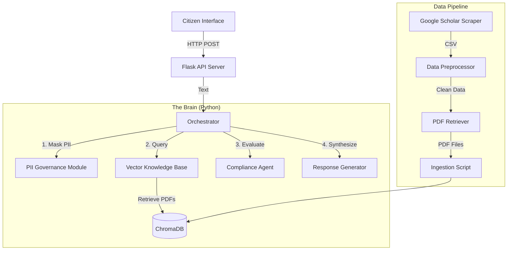

This is a comprehensive, student-ready `README.md`. It is designed to be a self-contained guide, meaning a student with zero prior knowledge of your specific setup could clone this repo and get it running.

It includes a dedicated **"Student Assignment"** section at the end, guiding them on how to graduate from "Robot Mode" to "Real AI."

-----

# 🏛️ AI Policy Orchestrator & Governance Framework

**A local-first, multi-agent AI system for analyzing government policies with privacy guardrails and Retrieval-Augmented Generation (RAG).**

   

## 📖 Introduction

Welcome to the **AI Policy Orchestrator**. This framework is designed to solve a critical problem in modern governance: **How can we use AI to answer citizen queries about complex regulations while ensuring privacy, accuracy, and compliance?**

This system is built as a **Multi-Agent Architecture**:

1.  **Privacy Guard:** Intercepts user messages to mask PII (Personally Identifiable Information).
2.  **Researcher (RAG):** Searches a vector database of official government PDFs.
3.  **Compliance Agent:** Evaluates requests against specific policy logic.
4.  **Orchestrator:** Manages the flow of data between these agents.

> **⚠️ Current State:** This project is currently in **"Template Mode"**. It performs all the real retrieval and analysis logic but uses pre-written template responses instead of a generative LLM (Large Language Model) to ensure deterministic behavior for testing.
>
> **🎓 Your Mission:** Your goal is to take this working skeleton and "give it a brain" by connecting it to a real LLM like **Llama 3 (via Ollama)** or **GPT-4 (via OpenAI)**. See the [Student Assignment](https://www.google.com/search?q=%23-student-assignment-next-steps) section.

-----

## 🏗️ System Architecture

The project follows a clean **Separation of Concerns** principle:



### 📂 Directory Structure

| Folder | Purpose |
| :--- | :--- |
| **`agent_orchestrator/`** | Contains `orchestrator.py`, the "Manager" that calls all other agents. |
| **`specialized_agents/`** | Contains `compliance_agent.py` (Rule Engine) and `extract_keywords.py` (NLP). |
| **`data_governance/`** | Contains `pii_masking.py` for stripping names/phones from inputs. |
| **`knowledge_base/`** | Contains `vector_store.py` (Database), `retrieve_pdfs.py` (Downloader), and Scrapers. |
| **`interface/`** | Contains `api_server.py`, the bridge between the Website and Python. |
| **`app/`** | The User Interface (Website) built with Jekyll (HTML/JS/CSS). |
| **`data/`** | **Local Storage** (Git Ignored). Holds raw PDFs and the Vector Database. |

-----

## ⚡ Prerequisites & Installation

### 1\. System Requirements

  * **OS:** macOS (Recommended), Linux (Ubuntu), or Windows (WSL2 required).
  * **RAM:** Minimum 8GB (16GB recommended if running local LLMs).
  * **Disk:** \~2GB free space.

### 2\. Install Languages

You need both **Python** (for the Brain) and **Ruby** (for the Interface).

  * **Python 3.11:** [Download Here](https://www.python.org/downloads/)
      * *Verify:* `python3 --version`
  * **Ruby 3.x:** [Download Here](https://www.ruby-lang.org/en/downloads/) (or use `rbenv`/`rvm`)
      * *Verify:* `ruby -v`
  * **Jekyll:** (The site generator)
      * *Install:* `gem install jekyll bundler`

### 3\. Clone & Configure

```bash
# 1. Clone the repository
git clone https://github.com/YOUR_USERNAME/ai-gov-policy-orchestrator.git
cd ai-gov-policy-orchestrator

# 2. Set up Python Virtual Environment
python3 -m venv .venv
source .venv/bin/activate  # (On Windows use: .venv\Scripts\activate)

# 3. Install Python Dependencies
pip install -r requirements.txt

# 4. Download NLP Models (Required for PII Masking)
python -m spacy download en_core_web_lg

# 5. Install Ruby/Jekyll Dependencies
bundle config set --global path '~/.gem'
bundle install
```

### 4\. Setup Environment Variables

Create a file named `.env` in the root folder to store your API keys.

```bash
touch .env
```

Open `.env` and add the following (if you have them):

```env
# Optional: Only needed for fresh web scraping
SERPAPI_KEY=your_serpapi_key_here

# Optional: Needed for Phase 2 (Student Assignment)
OPENAI_API_KEY=sk-proj-your-openai-key
```

-----

## 🏃 Execution Guide

This system requires **Data** to function. You must populate the database before running the chat.

### Phase 1: Data Ingestion (The Pipeline)

We have a robust `run_pipeline.py` script that handles data acquisition.

1.  **Generate Mock Data:** (Skips the need for a paid SerpApi key)

    ```bash
    python knowledge_base/mock_scholar_data.py
    ```

    *Result:* Creates a CSV in `data/raw/` with valid links to government PDFs (NIST, EU AI Act).

2.  **Run the Pipeline:**

    ```bash
    python run_pipeline.py
    ```

    *What this does:*

      * **Step 1:** Checks for data (skips scraping if CSV exists).
      * **Step 2-4:** Extracts keywords for the Graph Visualization.
      * **Step 5:** Generates the Knowledge Graph (`network_graph.html`).
      * **Step 6:** Downloads the actual PDFs and ingests them into the Vector Database.

    *Time Estimate: 2-5 minutes depending on internet speed.*

### Phase 2: Launching the System

You need **two terminal windows** running simultaneously.

**Terminal 1: The Brain (Python Backend)**

```bash
# Make sure your virtual env is active
source .venv/bin/activate
python interface/api_server.py
```

  * *Success Message:* `Running on http://0.0.0.0:5001`

**Terminal 2: The Face (Web Frontend)**

```bash
# Navigate to project root
bundle exec jekyll serve
```

  * *Success Message:* `Server address: http://127.0.0.1:4000/ai-gov-framework/`

### Phase 3: Using the Dashboard

Open your browser to:
👉 **[http://127.0.0.1:4000/ai-gov-framework/app/index.html](https://www.google.com/search?q=http://127.0.0.1:4000/ai-gov-framework/app/index.html)**

  * **Left Panel:** Interactive Knowledge Graph. Click nodes to see connections.
  * **Right Panel:** Chat Interface. Try asking:
      * *"What are the risks defined in the NIST framework?"*
      * *"Is biometric surveillance allowed in the EU?"*

-----

## 🎓 Next Steps

Currently, the `final_response` you see in the chat is a **hardcoded template** constructed in `agent_orchestrator/orchestrator.py`.

**Your Task:** Replace the template logic with a real Generative AI model.

### Option A: The "Free & Private" Path (Ollama)

Use your local computer's power to run Llama 3.

1.  **Download Ollama:** [ollama.com](https://ollama.com)
2.  **Pull a Model:** Run `ollama pull llama3` in your terminal.
3.  **Modify Code:**
      * Open `agent_orchestrator/orchestrator.py`.
      * Import `OpenAI` client.
      * Initialize client pointing to local server: `base_url='http://localhost:11434/v1'`.
      * Update `generate_response` function to send the **Context (PDF Text)** + **User Query** to the model.

### Option B: The "Commercial" Path (OpenAI)

Use GPT-3.5 or GPT-4 for higher accuracy.

1.  **Get an API Key:** Sign up at [platform.openai.com](https://platform.openai.com).
2.  **Add Key:** Put `OPENAI_API_KEY=...` in your `.env` file.
3.  **Modify Code:**
      * Open `agent_orchestrator/orchestrator.py`.
      * Initialize standard `OpenAI(api_key=...)` client.
      * Craft a System Prompt: *"You are a Helpful Government Assistant. Answer using ONLY the provided context."*

### Option C: The "Web Search" Path

The system is currently resilient to API failures.

  * **Challenge:** Re-enable `scrape_google_scholar.py` by getting a free trial key from **SerpApi**.
  * **Task:** Modify the Orchestrator to fallback to Google Search if the Vector DB returns no results.

-----

## 🐞 Troubleshooting

**Q: The pipeline fails at "Scraping".**
A: Ensure you ran `python knowledge_base/mock_scholar_data.py` first. The pipeline looks for that CSV file to skip the paid API step.

**Q: "Address already in use" (Port 5000/5001).**
A: On macOS, AirPlay uses Port 5000. We default to 5001. If 5001 is busy, edit `interface/api_server.py` (bottom lines) to use 5002.

**Q: "Not a PDF" error during download.**
A: Some academic sites block scripts. The `retrieve_pdfs.py` script has a "Smart Filter" to look for direct PDF links. If it fails, it skips that file. As long as you have 5-10 valid PDFs (like the NIST/EU ones), the system works fine.

-----

## 📜 License

This project is licensed under the MIT License - see the LICENSE file for details.